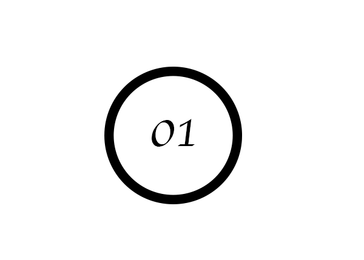
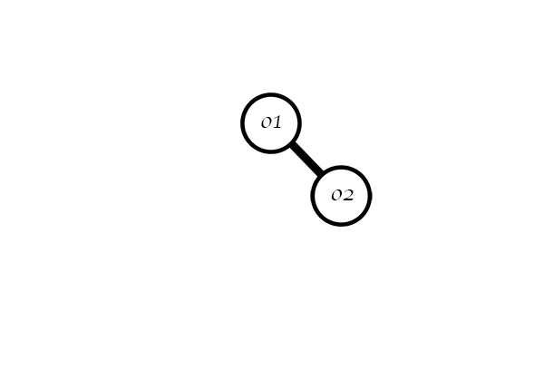
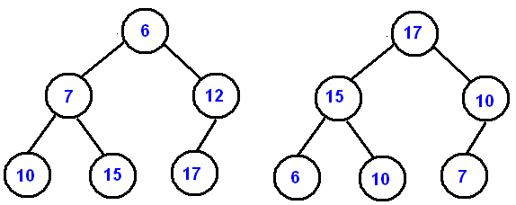

# Binary Trees and Heaps 

_There are many data structures that we've utilized as programmers, but we've yet to touch on the concept of a tree. Tree are defined as the following:_

>A tree is a collection of nodes connected by directed (or undirected) edges. A tree is a nonlinear data structure, compared to arrays, linked lists, stacks and queues which are linear data structures. A tree can be empty with no nodes or a tree is a structure consisting of one node called the root and zero or one or more subtrees.[1](#reference)

_Simply put, a tree is a collection of nodes with references to other nodes. Think of nodes as a container for the values within them. The values in the nodes define their relationship to one another._ 

_Binary trees are trees designed in such a way where every node can only have at-most two references to two other nodes._

## Binary Trees

In order to understand the binary tree, we need to understand the node. Let's visually depict a node like so: 

The number inside the node represents its value. This node has a value of `01`. The node itself is acting as a _container_ for its value. It also contains pointers to two other nodes in relation to itself. These nodes are known as its _children_. The original node is known as the _parent_. The first node in a set of all nodes is known as the _root_.

Let's add a child to our node: 

Here we added a node _to the right of the first node_. We are starting to implement a _binary search tree_ or BSTs. BSTs commit to the following property: 

>...for each node, it's value must be less than the values in the right sub-tree and greater than those in the left sub-tree.[2](#references)

Binary Search Trees are important because they allow for fast _insertion_, _removal_, and _lookup_. We utilize BSTs when we want to manipulate a collection while preserving its order.

Below are a few relevant notes:

- A _leaf node_ is a node that has no _children_.
  

- The connection between two nodes is described as an _edge_. This is visually depicted as the line connecting one node to another.
  

- We can describe a tree's _height_ by counting the amount of the outermost edges on one _path_. Alternatively, we can count down linearly to the deepest _leaf node_ starting from the root at `0`. 

## Heaps

Binary heaps are very similar to binary trees but where binary trees obey one property, binary heaps must obey two. Those properties are as follows: 

- _The binary heap must be complete._

- _The binary heap must either be a max heap (where the greater valued node is the parent of lesser valued nodes) , or a min heap (where the lesser valued node is the parent of greater valued nodes)._

Regular heap implementations only satisfy the first property. Binary heaps satisfy both.

What does it mean for a heap to be _complete_? Simply put, the heap is complete when it's fully filled with all nodes as far left as possible at the tree's _depth_ (or rather, _height_). [3](#references)

# References

1. [CMU CS: Data Structures](https://www.cs.cmu.edu/~clo/www/CMU/DataStructures/Lessons/lesson4_1.htm)
2. [Baeldung CS: Binary Search Trees](https://www.baeldung.com/cs/binary-search-trees)
3. [NIST: Complete Binary Tree](https://xlinux.nist.gov/dads/HTML/completeBinaryTree.html)
   
## Links

- [Wolfram Mathworld: Tree Mathematical Structure](https://mathworld.wolfram.com/Tree.html)
- [Binary Search Tree Lecture](http://ycpcs.github.io/cs201-fall2015/lectures/binarySearchTrees.html)
- [USFCA: Data Structure Visualizations](https://www.cs.usfca.edu/~galles/visualization/)
- [StackOverflow: What's the point of a key-value pair in Binary Search Trees?](https://stackoverflow.com/questions/14223139/whats-the-point-of-a-key-value-pair-in-a-binary-search-tree)

## Notes

- Visualizations are always helpful! I highly recommend checking out the visualizer in the links provided. 

- In the context of this `README.md`, node _values_ are acting like _keys_. Nodes can technically be structured in any way a user sees fit and as such can hold both a _key_, and a _value_. Check the stackoverflow link above for more info. 
  

- We wont be utilizing trees a lot in practice. However, be aware that a lot of the functionality is critical to your understanding of how certain collections are manipulated. Additionally, interview questions will often cover algorithms and unique data structures so it's important to be prepared for anything!